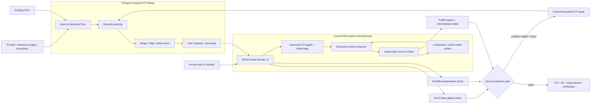

# ORIAI v2 設計案 — COrigami × Learn2Fold × Oriedita

- Status: Proposed
- Date: 2026-08-28
- Scope: 設計のみ。実装・公開環境の変更は含まない
- 用語: ユーザーのいう「Corigami」は、原論文の表記に合わせて以下 `COrigami` とする

## 1. 結論

ORIAI v2 は、次の3系統を分離して接続する。

1. **展開図設計** — COrigami-inspired な意味骨格、box-pleating、平坦折り可能CP生成
2. **折順計画** — Learn2Fold-inspired な固定CP上の状態追跡、候補手生成、物理検証、先読み
3. **編集・検証** — Codexによる制約調整と失敗解析、OrieditaによるCP編集・独立検証

現行の「CodexがOrieditaへ折り線を1本ずつ10回追加する」方式を主生成器にはしない。Codexは、数理ソルバーが扱う構造化候補の提案、候補選択、局所修復を担当する。OrieditaはCPの編集・2D平坦折り検証・書き出しに残す。

最重要の設計原則は、以下を同一視しないことである。

- `CP flat-foldability`: その展開図に平坦な折り上がり状態が存在するか
- `sequence feasibility`: 白紙から順番に操作して、その状態へ到達できるか
- `physical reproducibility`: 厚みのある実紙を人が実際に折れるか

これらは別々の検証結果として保存・表示する。

## 2. 現行方式との差分

現行公開版は、入力からクライアント側で単頂点候補を作り、構造RAGを参照し、CodexがOrieditaへ折り線を10本追加して毎回2D平坦折り像を採点する。実装自身が以下を明記している。

- `stateType: "crease_pattern_prefix"`
- `actionKind: "add_crease_via_oriedita_mcp"`
- `sequentialPhysicalFolding: false`
- `sequenceFeasibility: "unverified"`

根拠: `local-oriedita/server.mjs:1806-1813`、`README.md:47-53`

したがって現行の `step` は「紙を折る第n手」ではなく「CPへ線を加えた第n回」である。v2では型も探索器も分ける。

| 概念 | 現行 | v2 |
|---|---|---|
| Design action | 全幅の折り線を1本追加 | 骨格、配置、hinge/ridge/pleat、shaping構造の生成・修復 |
| Fold action | 存在しない | 固定CP上の fold / unfold / precrease / rotate / flip |
| 状態 | 累積CPのみ | CP + 各辺角度 + face姿勢 + layer/contact状態 |
| 物理検証 | Orieditaの2D平坦折り | CP検証と逐次操作検証を分離 |
| Codex | 操作主体かつ画像採点者 | 制約付き提案・修復・オーケストレーター |
| 出力 | 展開図、全折線同時の3D像 | 展開図、工程、各工程の状態、検証証明書 |

## 3. 採用する論文上の考え方

### 3.1 COrigamiから採用するもの

COrigamiは、LLMに巨大なSVG/CPを直接生成させない。次の分業を採用する。

1. 自然言語・画像を、連結かつ非巡回な `SemanticTree` へ変換
2. leafをflap、内部edgeをriverとして正方形整数グリッドへpacking
3. ridge、hinge、pleatを構成し、M/Vを決定
4. Kawasaki、Maekawa、crimping、face-order CSPで検証
5. simple foldとnarrowing等でshaping
6. 多視点レンダリングを独立した視覚評価器で比較

ORIAIでは、まず deterministic base generator を実装し、RL shapingは後段にする。論文のコード、学習済み重み、全データは公開されていないため、当面は **COrigami-inspired clean-room implementation** と呼ぶ。

### 3.2 Learn2Foldから採用するもの

Learn2Foldは「テキストだけから折順」ではない。入力は次である。

- 高水準の目標 `g`
- 固定済みのcanonical crease-pattern graph `G*`
- 現在の動的状態 `s_t`

紙の状態を、論文にならい概ね次で保持する。

```text
s_t = (edgeAngles, progress, assignments, globalFrame, mvFlip, step)
```

ORIAIでは、逐次検証に必要な派生状態も追加する。

```text
derived = (faceTransforms, layerOrder, contactGraph, collisionMask, reachableFaces)
```

各手では、候補生成器が複数の構造化actionを提案し、決定論的なLevel-0相当の検証器が不正候補を落とす。その後、世界モデルまたは初期版の決定論的コストが、目標進捗と将来の制約違反を先読みして候補を順位付けする。

論文の完全なaction schema、Level0Sim、world model構造、学習データ、重みは公開されていない。したがって完全再現ではなく、同じ責務分離を持つ独自実装とする。

## 4. 全体アーキテクチャ



単純な直列接続だけではなく、折順計画が失敗したedge、face、layer conflictをCP設計へ戻す。平坦折り可能でも順序が作れない候補は、次候補へ切り替えるか該当構造を修復する。

## 5. コンポーネント責務

| コンポーネント | 入力 | 出力 | 真実として扱う範囲 |
|---|---|---|---|
| Intent parser | prompt、画像、制約、RAG | `SemanticTree`、比率、対称性 | 意味上の提案のみ |
| CP packer | `SemanticTree` | flap/river/pocket配置 | 離散配置条件 |
| CP solver | packing | base CP、M/V、face | 実装した局所・大域条件 |
| Shaper | base CP、3D骨格 | shaped CP、generator trace | zero-thickness幾何 |
| Flat-Folder adapter | FOLD | face-order解、失敗理由 | flat-folded layer-order |
| Oriedita adapter | FOLD | 2D折り上がり、違反、PNG | Orieditaの計算範囲のみ |
| Fold proposer | goal、canonical CP、state | `FoldAction[]` | 候補。正解扱いしない |
| Sequential verifier | state、action | next state、valid、reason、mask | 実装した運動・衝突条件 |
| World model | graph、state、action | state差分、将来違反確率 | ranker。hard gateにしない |
| Visual judge | 目標、多視点render | 意味・見た目score | 美的評価のみ |
| Codex | 全stageの構造化情報 | 制約修正、候補提案、説明 | 数理・物理の判定源にしない |

## 6. 正本データ: ORIAI Model Bundle v2

FOLDはOriedita、Flat-Folder、Origami Simulatorとの交換形式として残す。一方、折順や生成履歴をFOLDの独自fieldだけへ埋め込まない。Orieditaが未知fieldを往復保持する保証がないため、versioned sidecarを正本にする。

```text
model.oriai/
  manifest.json
  intent.json
  semantic-tree.json
  packing.json
  base.fold
  shaped.fold
  cp-semantics.json
  validation.json
  fold-program.json
  states/
  renders/
  provenance.json
```

### 6.1 manifest

```ts
type OriaiModelBundleV2 = {
  schema: "oriai-model-bundle-v2";
  id: string;
  revision: number;
  cpHash: string;
  intentArtifact: string;
  semanticTreeArtifact: string;
  baseFoldArtifact: string;
  shapedFoldArtifact: string;
  foldProgramArtifact?: string;
  validationArtifact: string;
  provenanceArtifact: string;
};
```

`cpHash` を折順側へ必須で持たせる。OrieditaでCPを編集しhashが変わったら、既存の折順を自動的に `stale` にして再計画する。

### 6.2 CP semantics

FOLDのedge indexは編集で変わり得るため、正規化後のstable edge IDとtool別indexの対応をsidecarへ保存する。

```ts
type CpEdgeSemantic = {
  edgeId: string;
  foldEdgeIndex: number;
  assignment: "M" | "V" | "U" | "B" | "F";
  stage: "base" | "shaping";
  role: "hinge" | "ridge" | "pleat" | "adapter" | "shaping" | "boundary";
  semanticPartId?: string;
  generatorOpId?: string;
};
```

canonicalizationは次の順で行う。

1. 座標を紙面の `[0,1]^2` へ正規化
2. 全交点でedgeを分割し、重複・ゼロ長edgeを除去
3. vertexを座標辞書順、edgeを正規化端点順で並べる
4. geometry hashからstable IDを作る
5. 学習時のみ回転・反転をaugmentationし、向きとM/V flipを一貫変換する

### 6.3 FoldProgram

論文の未公開schemaを推測実装せず、ORIAI独自schemaを明示的にversion管理する。

```ts
type FoldProgramV1 = {
  schema: "oriai-fold-program-v1";
  cpHash: string;
  angleConvention: "degree:absolute:M-negative:V-positive";
  status: "partial" | "simulated" | "human_verified" | "stale";
  phases: Array<"precrease" | "base_collapse" | "shaping" | "finish">;
  actions: FoldActionV1[];
  validation: SequenceValidation;
};

type FoldActionV1 = {
  id: string;
  phase: "precrease" | "base_collapse" | "shaping" | "finish";
  op: "precrease" | "fold" | "unfold" | "rotate" | "flip";
  hingeEdgeIds: string[];
  movingFaceIds: string[];
  affectedEdgeIds: string[];
  targetAngleDeg?: number;
  assignment?: "M" | "V";
  preconditions: string[];
  postconditions: string[];
  stateBeforeHash: string;
  stateAfterHash: string;
  instructionJa: string;
  verification: {
    level0: "pass" | "fail";
    failureCode?: string;
    confidence?: number;
  };
};
```

初期action vocabularyはatomic operationに限定する。`sink`、`reverse`、`rabbit-ear`、`pleat`等は、検証可能なatomic列へ展開できるまで直接実行しない。

## 7. 生成・計画フロー

### Stage 0: Request normalization

入力を次へ正規化する。

- prompt / 参考画像
- pure origami: 単一正方形、切断なし
- 目標難易度、最大工程数、対称性
- 紙サイズと厚みはmetadataとして保持
- generator family: `box_pleat` / `retrieval` / 将来の別方式

COrigami型のtreeで表しにくい対象を無理にbox-pleatingへ通さず、adapter選択または非対応理由を返す。

### Stage 1: SemanticTree

LLM/Codexは自由文や生SVGではなく、schema制約付きtreeを出す。

- node/edgeの一意ID
- 部位名
- 長さ
- azimuth / elevation
- 左右対称pair
- importance
- root

4視点の骨格renderを別の視覚評価器へ渡し、部位数、比率、認識可能性、複雑度を確認する。ユーザーはここを後から編集できる。

### Stage 2: Discrete packing

- flapをstick長に応じた矩形へ変換
- riverを幅付き経路として配置
- pocketごとに依存部位をpacking
- 対称性、重なり、残面積で枝刈り
- flap expansionで空きセルを埋める
- grid sizeと探索seedを記録

1候補に固定せず、複数のpackingを保持する。

### Stage 3: CP solving

- pleatの水平/垂直方向を決定
- ridgeとpleatのM/Vを伝播
- hinge assignmentを制約付き探索
- Kawasaki、Maekawa、crimpingで局所検査
- Flat-Folderで大域face-order解を検査
- Orieditaで独立cross-check

hard checkに失敗した候補は視覚scoreに関係なく棄却する。

### Stage 4: Shaping

初期版はbase CPで止められるようにする。その後、以下を順に追加する。

1. SemanticTreeを使うBFS tree shaping
2. simple fold
3. narrowing template
4. 多視点renderと独立VLM比較
5. 十分なデータが集まった後にRL orchestration

baseとshaped CPを別artifactで残し、どのshaping operationがどのedgeを生成したか追跡する。

### Stage 5: Fold sequence planning

固定CPをcanonicalizeし、白紙状態から開始する。

1. proposerが `K` 個の構造化actionを生成
2. schema、edge/face存在、角度規約を検査
3. sequential Level-0 verifierで各候補を実行
4. invalid候補をfailure codeとaffected mask付きで除外
5. valid候補をgoal progress、将来衝突リスク、工程難易度で順位付け
6. 最良手を採用し、stateとartifactを保存
7. 候補が尽きたらnegative constraintを追加して再提案
8. 上限まで到達できなければ `partial` として返す

base collapseとshapingは別phaseとして計画し、中間checkpointで接続する。

### Stage 6: Joint candidate selection and repair

`CP候補 × 折順候補` をjointに評価する。

hard gate:

- CP schema valid
- local flat-fold checks pass
- global face-order solution exists
- Oriedita cross-check pass
- 全FoldActionがLevel-0 pass
- 最終stateが目標stateへ到達

hard gate通過後に、見た目、紙利用率、工程数、難易度をPareto比較する。単一の恣意的scoreだけで物理条件を上書きしない。

計画失敗時は次をCP側へ返す。

- problem edge/vertex IDs
- collision faces
- layer-order conflict
- unreachable face set
- 失敗phaseと最小再現action prefix

## 8. Sequential Level-0 verifier

Learn2Fold論文のLevel0Sim実装は未公開なので、ORIAIで仕様を定義する。MVPはzero-thicknessかつrestricted action setとし、次を検査する。

- 対象edge/faceの存在
- hingeに対するmoving face集合の連結性
- 現stateからのreachability
- M/Vとtarget angleの符号整合
- face剛性とedge長の保存
- face transform後の自己交差
- layer-orderの循環・貫通
- locked crease / contact conflict
- 数値誤差上限

以下は別badgeで `unknown` を許す。

- 紙厚
- bulking
- 手や指のアクセス可能性
- 紙の伸び、滑り、破断

Origami Simulatorは全折線同時の近似3D previewとして残せるが、Level-0のhard verifierにはしない。OrieditaもCP全体の平坦折り検証を担い、逐次state transitionの代用にはしない。

## 9. CodexとOrieditaの新しい役割

### Codex

- SemanticTree候補をschema付きで提案
- ソルバー失敗理由から制約を修正
- 複数CP/sequence候補を根拠付きで比較
- Orieditaでの人間編集をModel Bundleへ取り込む
- failure prefixを説明し、再探索条件を作る

Codex自身の画像scoreを物理判定に使わない。視覚評価は別call・別rubricとし、数理検証結果を変更できないようにする。

### Oriedita

- FOLDの読込・編集・書出し
- 局所違反と2D平坦折り像の独立確認
- 人間がCPを手直しするUI
- before/after artifactの保存

新しい `corigami_generate` modeでは、現行の「add_lineを必ず10回」を実行しない。数学的に完成したCPへ任意の全幅線を加えると、構造を壊し得るためである。

## 10. サイトUX

### 10.1 入力

現在の簡潔なprompt＋画像UIは残し、折りたたみ式の詳細設定を追加する。

- かんたん / 標準 / 研究モード
- 希望する工程数・難易度
- 対称性
- 紙サイズ
- 「骨格を確認しながら作る」co-design mode

### 10.2 生成中

「Codexが操作中」という一文ではなく、実際のstageを表示する。

```text
意図解析 → 骨格 → 紙面配置 → 展開図検証 → 折順探索 → レンダリング
```

各stageは `queued / running / passed / partial / failed` を持つ。CPが完成し折順だけ失敗した場合、ジョブ全体を一律失敗にせずCPを返す。

### 10.3 結果

結果workspaceを4タブにする。

1. **完成イメージ** — 多視点3D、zero-thickness注記
2. **展開図** — base / shaped切替、M/V、部位overlay、FOLD download
3. **折り方** — 前へ/次へ/再生、各手の3D state、山谷、動かす面、説明
4. **検証** — 各検証badge、失敗理由、生成履歴、出典・license

表示badgeは最低限次を分ける。

```text
CP局所条件       pass / fail / unknown
大域平坦折り     pass / fail / unknown
逐次運動         pass / partial / fail / unknown
衝突             pass / fail / unknown
紙厚             pass / fail / unknown
人間による実折り verified / unverified
```

現行の「完成形3D」は、逐次・厚み・実折り未検証時には「シミュレーション上の折り上がり」へ改める。

## 11. API・ジョブ設計

新APIはstageとartifactを第一級にする。

```text
POST /v2/design-jobs
GET  /v2/design-jobs/{id}
GET  /v2/design-jobs/{id}/artifacts
POST /v2/design-jobs/{id}/revisions
POST /v2/design-jobs/{id}/replan
```

`GET job` の概念例:

```json
{
  "id": "...",
  "status": "running",
  "stages": [
    { "name": "semantic_tree", "status": "passed" },
    { "name": "cp_packing", "status": "passed" },
    { "name": "cp_validation", "status": "passed" },
    { "name": "sequence_planning", "status": "running" }
  ],
  "bestCandidateId": "...",
  "partialArtifacts": []
}
```

現行のインメモリ直列queueから、少なくとも以下へ移行する。

- SQLite等によるjob/stage/artifact metadata永続化
- stage単位のidempotencyとresume
- immutable artifact + revision
- 大きなstate画像をbase64でjob JSONへ詰めず、job-scoped artifact URLで取得
- 公開POST APIの認証、rate limit、job ownership
- CPU solverと将来のGPU model workerをadapterで分離

静的GitHub Pagesフロントは当面維持できる。重い処理を担うAPIのURL発見、一時トンネル、再起動耐性は別の運用課題として改善する。

## 12. 実装境界

既存コードを一度にworkspace化せず、初期は現在の構成へ以下を追加する。

```text
schemas/v2/
  semantic-tree.schema.json
  cp-semantics.schema.json
  fold-program.schema.json
  validation-certificate.schema.json

local-oriedita/pipeline/
  orchestrator.mjs
  artifact-store.mjs
  candidate-gate.mjs

engines/cp/
  packer/
  solver/
  flat-folder-adapter/

engines/sequence/
  canonicalize/
  proposer/
  level0/
  planner/
  world-model-adapter/
```

境界interfaceは先に固定する。

```ts
interface CpGenerator {
  generate(intent: DesignIntent): AsyncIterable<CpCandidate>;
}

interface CpValidator {
  validate(candidate: CpCandidate): Promise<CpValidation>;
}

interface FoldPlanner {
  plan(cp: CanonicalCp, goal: Goal, limits: PlanLimits): Promise<FoldProgramV1>;
}

interface StepSimulator {
  transition(state: FoldState, action: FoldActionV1): Promise<TransitionResult>;
}
```

公式コードが後日公開された場合も、このadapterの内側だけを差し替え、API・UI・artifact形式を変えない。

## 13. データ方針

現行の5,157件の構造知識は、SemanticTreeやpackingの参考には使えるが、人間検証済み折順ではない。Learn2Fold用の正例へ自動転用しない。

折順データは次を必要とする。

- 利用許諾と出典
- canonical CP
- atomic action列
- 各stepの中間state
- moving face / affected edge
- 角度規約
- simulator version
- human validation status

進め方:

1. 許諾済みの単純作品でgold setを作る
2. annotation toolで既存diagramをatomic actionへ変換
3. Level-0でreplayし、不整合を人が修正
4. verified transitionへ制約境界付近のperturbationを加える
5. CP topology単位でtrain/testを分離
6. 実行logが十分に集まってからedge-GNN world modelを学習

World modelはhard verifierを置き換えず、探索のranker/acceleratorとしてのみ導入する。

## 14. 段階導入

### Phase 0 — 契約と表示の正直さ

- `DesignAction` と `FoldAction` を別schema化
- Model Bundle、cpHash、validation certificateを実装
- 現行結果に検証範囲badgeを追加
- 現行3Dを「全折線同時preview」と明示

完了条件: 同じFOLDからstable canonical IDと同じhashを再現でき、CP編集時にsequenceが確実にstaleになる。

### Phase 1A — COrigami-inspired base generator

- SemanticTree
- discrete packer
- hinge/ridge/pleat solver
- FOLD export
- Flat-Folder + Oriedita二重検証
- 複数候補保存

完了条件: 独自fixtureで局所・大域条件を通るbase CPを再現可能に生成し、Orieditaでround-tripできる。

### Phase 1B — Learn2Fold-inspired deterministic planner

Phase 1Aと並行して、許諾済みの既知CPで作る。

- atomic FoldAction
- sequential state
- Level-0 verifier
- constrained JSON proposer
- beam/MPC search
- step player

world modelはまだ入れない。

完了条件: gold setを白紙から最終stateまでdeterministic replayでき、各stepのstate hashとfailure reasonを再現できる。

### Phase 2 — Joint integration

- 生成CPをplannerへ渡す
- `CP候補 × plan候補` joint selection
- problem maskをCP repairへ返す
- base collapse / shaping phaseの接続
- partial result UX

完了条件: 少なくとも制限した対象familyで、CP生成から工程表示までend-to-endで完了し、実紙テストとの差を記録できる。

### Phase 3 — Shapingと学習

- simple fold、narrowing
- 多視点の独立VLM評価
- transition dataset
- graph world model
- MPC ranker

完了条件: 固定benchmarkでdeterministic baselineを上回り、hard-valid率を落とさない。

### Phase 4 — 研究拡張

- sink / reverse / pleat macroの検証可能な展開
- 紙厚と手のaccessibility
- RL shaping
- 物理試作feedback
- box-pleating以外のgenerator adapter

## 15. 成功指標

### CP

- packing success rate
- local violation count
- global face-order solution rate
- Oriedita cross-check一致率
- grid size、紙面利用率
- target部位coverage

### 折順

- step validity
- full trajectory success
- final goal distance
- affected-edge accuracy（正解データがある場合）
- re-sample回数、探索時間
- 工程数、難易度

### 実紙

- 人間が最後まで折れた割合
- 詰まったstep
- 所要時間
- 紙厚・layer数による失敗
- 説明だけで再現できた割合

研究上のscoreとサイト上の表現を一致させる。`simulated` を `human_verified` と表示しない。

## 16. リスクと対策

| リスク | 対策 |
|---|---|
| 両論文の公式実装・重み・全データが未公開 | clean-room adapter実装。著者へschema/code/licenseを確認 |
| COrigamiの全体成功率は候補大量生成に依存 | 対象familyとgridを限定し、複数候補・途中結果を返す |
| flat-foldableでも順番に折れない | sequence hard gateとCP repair loopを必須化 |
| Learn2Fold論文の完全action/Level0仕様が不明 | ORIAI schemaとfailure taxonomyを独自に公開・test |
| current simulatorが全折線同時 | preview限定。別のsequential kernelを作る |
| training dataの権利と品質 | provenance、license、human-approved flagを必須化 |
| VLMが見た目と物理を混同 | 数理hard gateと視覚scoreを別channelにする |
| zero-thicknessと実紙の差 | badge、実紙gold test、後段の厚みモデル |
| 長時間jobと再起動 | stage永続化、resume、partial artifacts |

## 17. 今回の推奨判断

1. **完全再現を名乗らず、COrigami-inspired / Learn2Fold-inspired とする**
2. **FOLDを交換形式、Model Bundle sidecarを正本にする**
3. **COrigami系とLearn2Fold系を別trackで先に成立させ、その後統合する**
4. **MVPではworld modelとRLを入れず、決定論的solver/verifierを先に作る**
5. **Codexを主幾何生成器から、制約提案・失敗修復・オーケストレーターへ移す**
6. **Orieditaを捨てず、独立CP validatorと人間編集面として使う**
7. **折順失敗をCP候補へ戻す閉ループを最初からデータ契約へ含める**

## 18. 未確定事項

実装前に決める必要があるのは次の4点である。

1. MVPの対象family: 簡略な鳥・魚・四足動物など、どこまでに絞るか
2. 逐次kernelの物理範囲: zero-thickness rigid faceまでか、layer collisionまで含めるか
3. 許諾済み折順gold setをどう用意するか
4. GPU workerを初期から用意するか、deterministic CPU版で始めるか

本設計の推奨値は、**対象familyを限定、zero-thickness + layer collision、許諾済みgold set、CPU baselineから開始**である。

## 19. 一次資料

- [COrigami paper](https://arxiv.org/abs/2606.26299)
- [COrigami official project page](https://www.tomzahavy.com/projects/corigami)
- [Learn2Fold paper](https://arxiv.org/abs/2603.29585)
- [FOLD specification v1.2](https://github.com/edemaine/fold/blob/main/doc/spec.md)
- [Computing Flat-Folded States / Flat-Folder paper](https://erikdemaine.org/papers/FlatFolder_OSME2024/)
- [Flat-Folder implementation](https://github.com/origamimagiro/flat-folder)
- [Origami Simulator implementation](https://github.com/amandaghassaei/OrigamiSimulator)

### 再現上の注意

2026-08-28時点で、COrigamiは公式サンプルCPを公開しているが実装・重み・全データへのリンクはなく、Learn2Foldも原論文から利用可能な公式code/model/datasetを確認できない。Learn2Fold本文にはデータ件数等の記述差もあるため、論文のheadline値を受入基準へ直接使わず、ORIAI独自benchmarkで再検証する。
